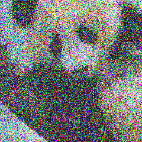
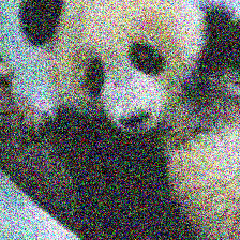
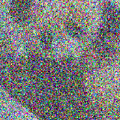
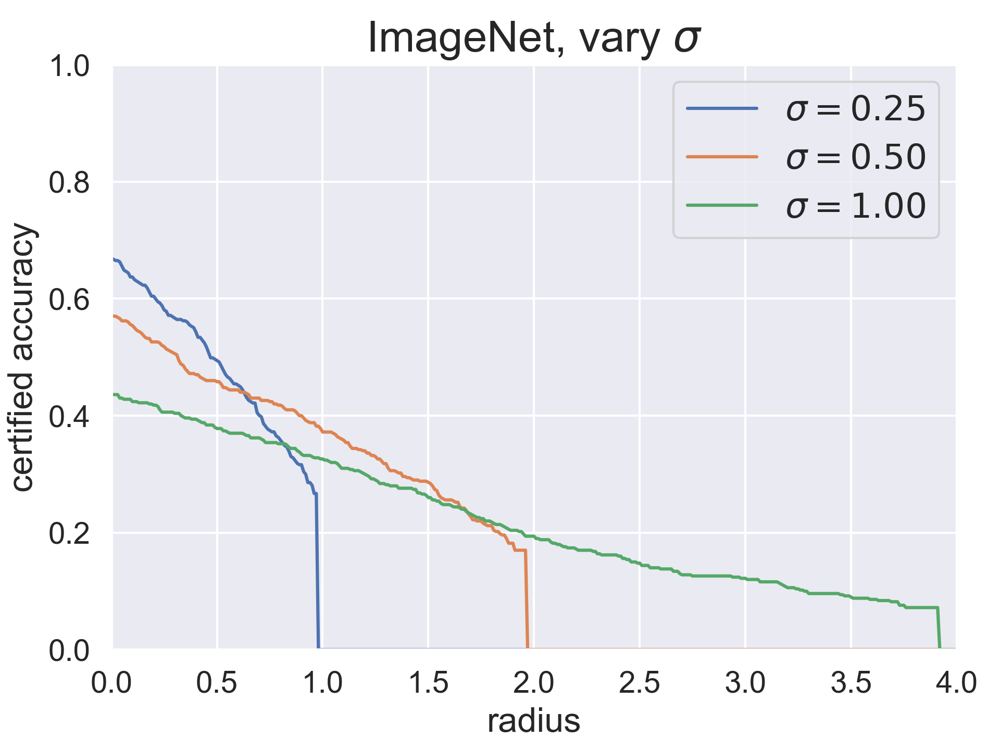

# Certified Adversarial Robustness via Randomized Smoothing

This repository contains code and trained models for the paper [Certified Adversarial Robustness via Randomized Smoothing](https://arxiv.org/abs/1902.02918) by [Jeremy Cohen](http://cs.cmu.edu/~jeremiac), Elan Rosenfeld, and [Zico Kolter](http://zicokolter.com).

Randomized smoothing is a **provable** adversarial defense in L2 norm which **scales to ImageNet.**
It's also SOTA on the smaller datasets like CIFAR-10 and SVHN where other provable L2-robust classifiers are viable.

## How does it work?

First, you train a neural network _f_ with Gaussian data augmentation at variance &sigma;<sup>2</sup>.
Then you leverage _f_ to create a new, "smoothed" classifier _g_, defined as follows:
_g(x)_ returns the class which _f_ is most likely to return when _x_
is corrupted by isotropic Gaussian noise with variance &sigma;<sup>2</sup>. 

<p>


</p>


For example, let _x_ be the image above on the left.
Suppose that when _f_ classifies _x_ corrupted by Gaussian noise (the GIF on the right), _f_ returns "panda"
98\% of the time and "gibbon" 2% of the time.
Then the prediction of _g_ at _x_ is defined to be "panda."
 

Interestingly, _g_ is **provably** robust within an L2 norm ball around _x_, in the sense that for any perturbation 
&delta; with sufficiently small L2 norm, _g(x+&delta;)_ is guaranteed to be "panda."
In this particular example, _g_ will be robust around _x_ within an L2 radius of &sigma; &Phi;<sup>-1</sup>(0.98) &asymp; 2.05 &sigma;,
where &Phi;<sup>-1</sup> is the inverse CDF of the standard normal distribution.

In general, suppose that when _f_ classifies noisy corruptions of _x_, the class "panda" is returned with probability _p_ (with _p_ > 0.5).
Then _g_ is guaranteed to classify "panda" within an L2 ball around _x_ of radius &sigma; &Phi;<sup>-1</sup>(_p_).

### What's the intuition behind this bound?

We know that _f_ classifies noisy corruptions of _x_ as "panda" with probability 0.98.
An equivalent way of phrasing this that the Gaussian distribution N(x, &sigma;<sup>2</sup>I) puts measure 0.98 on
the decision region of class "panda," defined as the set {x': f(x') = "panda"}.
You can prove that no matter how the decision regions of _f_ are "shaped", for any &delta; with
||&delta;||<sub>2</sub> < &sigma; &Phi;<sup>-1</sup>(0.98), the translated Gaussian N(x+&delta;, &sigma;<sup>2</sup>I) is guaranteed to put measure > 0.5 on the decision region of
class "panda," implying that _g(x+&delta;)_ = "panda."

### Wait a minute...
There's one catch: it's not possible to actually evaluate the smoothed classifer _g_.
This is because it's not possible to exactly compute the probability distribution over the classes when _f_'s input is corrupted by Gaussian noise.
For the same reason, it's not possible to exactly compute the radius in which _g_ is provably robust.

Instead, we give Monte Carlo algorithms for both
1. **prediction**: evaluating _g_(x)
2. **certification**: computing the L2 radius in which _g_ is robust around _x_

which are guaranteed to return a correct answer with arbitrarily high probability.

The prediction algorithm does this by abstaining from making any prediction when it's a "close call," e.g. if
 510 noisy corruptions of _x_ were classified as "panda" and 490 were classified as "gibbon."
Prediction is pretty cheap, since you don't need to use very many samples.
For example, with our ImageNet classifier, making a prediction using 1000 samples took 1.5 seconds, and our classifier abstained 3\% of the time.

On the other hand, certification is pretty slow, since you need _a lot_ of samples to say with high
probability that the measure under N(x, &sigma;<sup>2</sup>I) of the "panda" decision region is close to 1.
In our experiments we used 100,000 samples, so making each certification took 150 seconds.

### Related work

Randomized smoothing was first proposed in [Certified Robustness to Adversarial Examples with Differential Privacy](https://arxiv.org/abs/1802.03471)
and later improved upon in [Second-Order Adversarial Attack and Certified Robustness](https://arxiv.org/abs/1809.03113).
We simply tightened the analysis and showed that it outperforms the other provably L2-robust classifiers that have been proposed in the literature. 

## ImageNet results

We constructed three randomized smoothing classifiers for ImageNet, with the hyperparameter
&sigma; set to 0.25, 0.50, and 1.00.
Here's what the panda image looks like under these three noise levels:

<p>



</p>


The plot below shows the certified top-1 accuracy at various radii of these three classifiers.
The "certified accuracy" of a classifier _g_ at radius _r_ is defined as test set accuracy that _g_ will 
provably attain under any possible adversarial attack with L2 norm less than _r_. 
As you can see, the hyperparameter &sigma; controls a robustness/accuracy tradeoff: when
&sigma; is high, the standard accuracy is lower, but the classifier's correct predictions are 
robust within larger radii.

<a href="analysis/plots/vary_noise_imagenet.pdf"></a>

To put these numbers in context: on ImageNet, random guessing would achieve a top-1 accuracy of 0.001.
A perturbation with L2 norm of 1.0 could change one pixel by 255, ten pixels by 80, 100 pixels by 25, or 1000 pixels by 8.  


Here's the same data in tabular form.
The best &sigma; for each radius is denoted with an asterisk.

|  | r = 0.0 |r = 0.5 |r = 1.0 |r = 1.5 |r = 2.0 |r = 2.5 |r = 3.0 |
| --- |  --- | --- | --- | --- | --- | --- | --- |
<b> &sigma; = 0.25 </b>| 0.67<b>*</b> |0.49<b>*</b> |0.00 |0.00 |0.00 |0.00 |0.00 |
<b> &sigma; = 0.50 </b>| 0.57 |0.46 |0.38<b>*</b> |0.28<b>*</b> |0.00 |0.00 |0.00 |
<b> &sigma; = 1.00 </b>| 0.44 |0.38 |0.33 |0.26 |0.19<b>*</b> |0.15<b>*</b> |0.12<b>*</b> |


<!--
## How does it do on CIFAR-10?

<a href="analysis/plots/vary_noise_cifar10_resnet110_test.pdf"></a>


|  | r = 0.0 |r = 0.25 |r = 0.5 |r = 0.75 |r = 1.0 |r = 1.25 |r = 1.5 |
| --- |  --- | --- | --- | --- | --- | --- | --- |
<b> &sigma; = 0.25 </b>| 0.77<b>*</b> |0.60<b>*</b> |0.42<b>*</b> |0.24 |0.00 |0.00 |0.00 |
<b> &sigma; = 0.50 </b>| 0.66 |0.55 |0.42 |0.31<b>*</b> |0.21 |0.14 |0.08 |
<b> &sigma; = 1.00 </b>| 0.47 |0.40 |0.33 |0.27 |0.22<b>*</b> |0.18<b>*</b> |0.14<b>*</b> |
-->

## This repository

### Outline

The contents of this repository are as follows:

* [code/](code) contains the code for our experiments.
* [data/](data) contains the raw data from our experiments.
* [analysis/](analysis) contains the plots and tables, based on the contents of [data](/data), that are shown in our paper.

If you'd like to run our code, you need to download our models from [here](https://drive.google.com/file/d/1h_TpbXm5haY5f-l4--IKylmdz6tvPoR4/view?usp=sharing)
and then move the directory `models` into the root directory of this repo.

### Smoothed classifiers

Randomized smoothing is implemented in the `Smooth` class in [core.py](code/core.py).

* To instantiate a smoothed clasifier _g_, use the constructor:

 ```def __init__(self, base_classifier: torch.nn.Module, num_classes: int, sigma: float):```

where `base_classifier` is a PyTorch module that implements _f_, `num_classes` is the number of classes in the output
space, and `sigma` is the noise hyperparameter &sigma; 

* To make a prediction at an input `x`, call:

```    def predict(self, x: torch.tensor, n: int, alpha: float, batch_size: int) -> int:```
 
 where `n` is the number of Monte Carlo samples and `alpha` is the confidence level.
 This function will either (1) return `-1` to abstain or (2) return a class which equals _g(x)_
 with probability at least `1 - alpha`.
 
 * To compute a radius in which _g_ is robust around an input `x`, call:
 
 ```def certify(self, x: torch.tensor, n0: int, n: int, alpha: float, batch_size: int) -> (int, float):```  

where `n0` is the number of Monte Carlo samples to use for selection (see the paper), `n` is the number of Monte Carlo
samples to use for estimation, and `alpha` is the confidence level.
This function will either return the pair `(-1, 0.0)` to abstain, or return a pair
`(prediction, radius)` for which with probability at least `1 - alpha`, _g(x)_ = `prediction`
 and _g_ is robust around _x_ with radius at least `radius`. 
 
### Scripts

* The program [train.py](code/train.py) trains a base classifier with Gaussian data augmentation:

```python code/train.py imagenet resnet50  model_output_dir --batch 400 --noise 0.50 ```  

will train a ResNet-50 on ImageNet under Gaussian data augmentation with &sigma;=0.50.

* The program [predict.py](code/predict.py) makes predictions using _g_ on a bunch of inputs.  For example,

```python code/predict.py imagenet model_output_dir/checkpoint.pth.tar 0.50 prediction_outupt --alpha 0.001 --N 1000 --skip 100 --batch 400```

will load the base classifier saved at `model_output_dir/checkpoint.pth.tar`, smooth it using noise level &sigma;=0.50,
and classify every 100-th image from the ImageNet test set with parameters `N=1000`
and `alpha=0.001`.

* The program [certify.py](code/certify.py) certifies the robustness of _g_ on bunch of inputs.  For example,

```python code/certify.py imagenet model_output_dir/checkpoint.pth.tar 0.50 certification_output --alpha 0.001 --N0 100 --N 100000 --skip 100 --batch 400```

will load the base classifier saved at `model_output_dir/checkpoint.pth.tar`, smooth it using noise level &sigma;=0.50,
and certify every 100-th image from the ImageNet test set with parameters `N0=100`, `N=100000`
and `alpha=0.001`.

* The program [visualize.py](code/visualize.py) outputs pictures of noisy examples.  For example,

```python code/visualize.py imagenet visualize_output 100 0.0 0.25 0.5 1.0```

will visualize noisy corruptions of the 100-th image from the ImageNet test set with noise levels 
&sigma;=0.0, &sigma;=0.25, &sigma;=0.50, and &sigma;=1.00.   

* The program [analyze.py](code/analyze.py) generates all of certified accuracy plots and tables that appeared in the
paper.

Finally, we note that [this file](experiments.MD) describes exactly how to reproduce
 our experiments from the paper.
 
 
 We're not officially releasing code for the experiments where we compared randomized smoothing against the baselines,
 since that code involved a number of hacks, but feel free to get in touch if you'd like to see that code.

## Getting started

1.  Clone this repository: `git clone git@github.com:locuslab/smoothing.git`

2.  Install the dependencies:  
```
conda create -n smoothing
conda activate smoothing
# below is for linux, with CUDA 10; see https://pytorch.org/ for the correct command for your system
conda install pytorch torchvision cudatoolkit=10.0 -c pytorch 
conda install scipy pandas statmodels matplotlib seaborn
pip install setGPU
```
3.  Download our trained models from [here](https://drive.google.com/file/d/1h_TpbXm5haY5f-l4--IKylmdz6tvPoR4/view?usp=sharing).
4. If you want to run ImageNet experiments, obtain a copy of ImageNet and preprocess the `val` directory to look
like the `train` directory by running [this script](https://raw.githubusercontent.com/soumith/imagenetloader.torch/master/valprep.sh).
Finally, set the environment variable `IMAGENET_DIR` to the directory where ImageNet is located.

5. To get the hang of things, try running this command, which will certify the robustness of one of our pretrained CIFAR-10 models
on the CIFAR test set.
```
model="models/cifar10/resnet110/noise_0.25/checkpoint.pth.tar"
output="???"
python code/certify.py cifar10 $model 0.25 $output --skip 20 --batch 400
```
where `???` is your desired output file.
